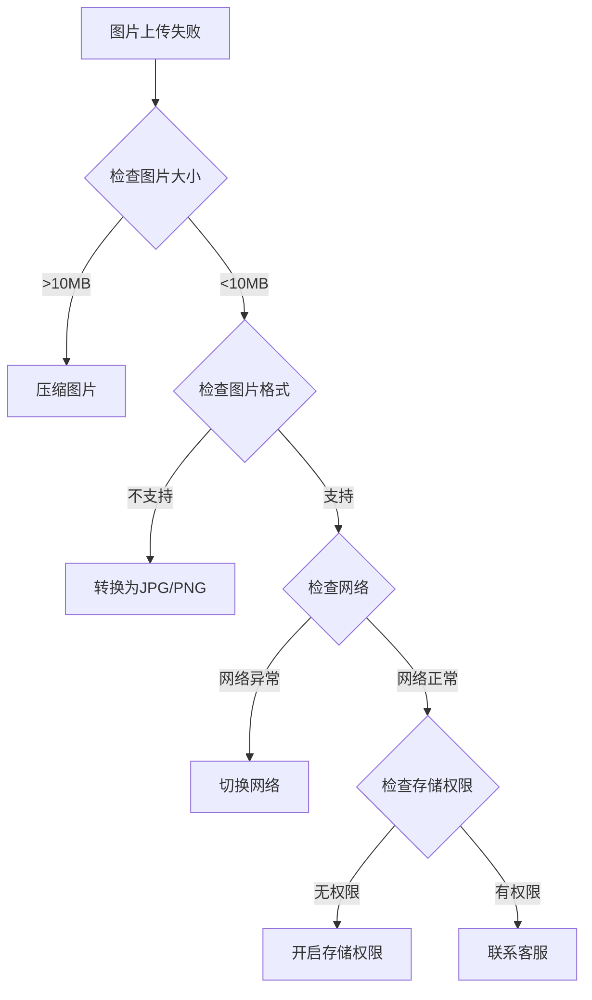

# 🔧 故障排除

## 🚨 紧急问题快速解决

### 应用无法启动
**症状**: 点击应用图标后闪退或无响应

**解决步骤**:
1. **重启手机** - 解决临时系统问题
2. **检查存储空间** - 确保至少有100MB可用空间
3. **清理后台应用** - 释放内存资源
4. **重新安装应用** - 解决安装文件损坏问题

**高级解决方案**:
```
设置 → 应用管理 → TOMO → 强制停止 → 清除数据 → 重新启动
```

### 网络连接问题
**症状**: 无法获取价格信息，显示网络错误

**诊断步骤**:
1. **检查网络连接**
   - WiFi: 尝试断开重连
   - 移动数据: 检查流量是否充足
   - 网络速度: 确保网速 > 1Mbps

2. **DNS设置检查**
   - 尝试切换到公共DNS (8.8.8.8)
   - 重置网络设置

3. **防火墙检查**
   - 确保TOMO未被防火墙阻止
   - 检查企业网络限制

## 🎤 语音功能故障

### 语音识别完全无效
**可能原因及解决方案**:

| 原因 | 解决方案 |
|------|----------|
| 麦克风权限未开启 | 设置 → 权限管理 → TOMO → 麦克风 → 允许 |
| 麦克风硬件故障 | 测试其他录音应用，如有问题请检修硬件 |
| 系统语音服务异常 | 设置 → 语言和输入法 → 语音输入 → 重置 |
| 网络延迟过高 | 切换到更稳定的网络环境 |

### 语音识别准确率低
**优化设置**:
1. **环境优化**
   - 在安静环境下使用
   - 距离麦克风15-30cm
   - 避免背景噪音

2. **语音训练**
   - 设置 → 语音设置 → 语音训练
   - 录制个人语音样本
   - 适应个人口音特点

3. **语言设置**
   ```
   设置 → 语言设置 → 选择主要使用语言
   ```

## 📷 图片识别故障

### 图片上传失败
**故障排查流程**:



### OCR识别效果差
**图片质量要求**:
- **分辨率**: 最低720p，推荐1080p以上
- **清晰度**: 文字边缘清晰，无模糊
- **对比度**: 文字与背景对比明显
- **角度**: 正面拍摄，倾斜角度<15°

**拍摄技巧**:
1. 使用手机自带相机的文档模式
2. 开启HDR功能提高对比度
3. 避免反光和阴影
4. 多拍几张选择最清晰的

## 🔵 悬浮球功能故障

### 悬浮球不显示
**系统权限检查清单**:

**Android 原生系统**:
```
设置 → 应用和通知 → 特殊应用权限 → 显示在其他应用上层 → TOMO → 允许
```

**小米 MIUI**:
```
设置 → 应用设置 → 应用管理 → TOMO → 权限管理 → 显示悬浮窗 → 允许
```

**华为 EMUI**:
```
设置 → 应用和通知 → 权限管理 → 悬浮窗 → TOMO → 允许
```

**OPPO ColorOS**:
```
设置 → 应用管理 → TOMO → 权限 → 悬浮窗 → 允许
```

**vivo FuntouchOS**:
```
设置 → 更多设置 → 权限管理 → 悬浮窗 → TOMO → 允许
```

### 悬浮球功能异常
**常见问题及解决**:

| 问题 | 原因 | 解决方案 |
|------|------|----------|
| 悬浮球无法拖动 | 系统限制 | 重启应用或手机 |
| 点击无响应 | 权限冲突 | 关闭其他悬浮窗应用 |
| 自动消失 | 内存不足 | 清理后台应用 |
| 显示异常 | 系统兼容性 | 更新应用版本 |

## 💰 价格数据问题

### 价格显示异常
**数据同步问题**:
1. **手动刷新**
   - 下拉刷新价格列表
   - 或点击刷新按钮

2. **清除缓存**
   ```
   设置 → 存储管理 → 清除价格缓存
   ```

3. **时区设置**
   - 确保手机时区设置正确
   - 价格可能因时区不同而变化

### 价格更新延迟
**优化网络连接**:
1. **网络诊断**
   ```bash
   # 测试网络延迟
   ping api.tomo-app.com
   ```

2. **DNS优化**
   - 设置DNS为 8.8.8.8 或 1.1.1.1
   - 清除DNS缓存

3. **CDN节点选择**
   - 设置 → 高级设置 → 服务器节点 → 自动选择最优

## 📱 性能优化

### 应用运行缓慢
**性能诊断工具**:

应用内置性能监控：
```
设置 → 开发者选项 → 性能监控 → 开启
```

**优化建议**:
1. **内存优化**
   - 关闭不必要的后台应用
   - 定期重启手机
   - 清理应用缓存

2. **存储优化**
   - 保持至少15%的存储空间
   - 清理无用的下载文件
   - 移动照片到云存储

3. **网络优化**
   - 使用5GHz WiFi频段
   - 避免网络高峰期使用
   - 关闭VPN（如不必要）

### 电池消耗过快
**省电设置**:
```
设置 → 电池优化 → TOMO → 智能省电模式
```

**后台限制**:
- 限制后台刷新频率
- 关闭不必要的推送通知
- 降低定位精度要求

## 🔄 数据恢复

### 搜索历史丢失
**数据备份检查**:
1. **本地备份**
   ```
   设置 → 数据管理 → 本地备份 → 恢复数据
   ```

2. **云端同步**
   - 检查账户登录状态
   - 手动同步数据
   ```
   设置 → 账户同步 → 立即同步
   ```

### 设置重置
**配置文件恢复**:
```
设置 → 高级设置 → 导入配置文件
```

**默认设置恢复**:
```
设置 → 重置 → 恢复默认设置
```

## 🆘 紧急联系

### 严重故障报告
**收集信息清单**:
- [ ] 手机型号和系统版本
- [ ] 应用版本号
- [ ] 故障发生时间
- [ ] 详细操作步骤
- [ ] 错误截图或录屏
- [ ] 崩溃日志（如有）

**快速联系方式**:
- **紧急邮箱**: emergency@tomo-app.com
- **技术支持QQ群**: 123456789
- **24小时热线**: 400-123-4567

### 日志收集
**自动日志收集**:
```
设置 → 帮助与反馈 → 发送诊断信息
```

**手动日志导出**:
```
设置 → 开发者选项 → 导出日志文件
```

---

⚠️ **重要提醒**: 如果以上方法都无法解决问题，请不要反复尝试，及时联系技术支持团队，避免数据丢失或设备损坏。